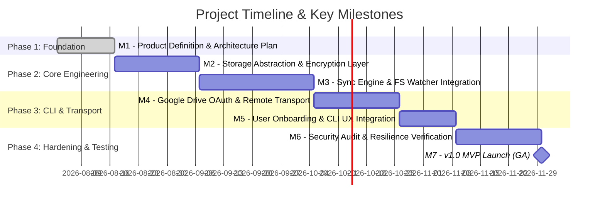
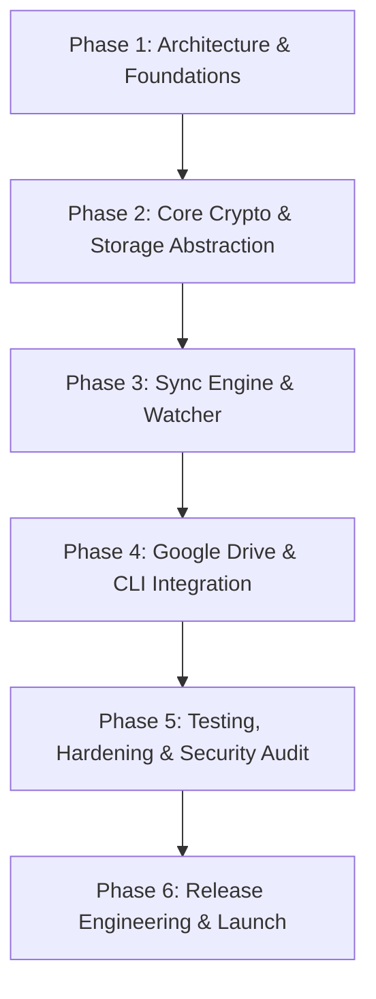
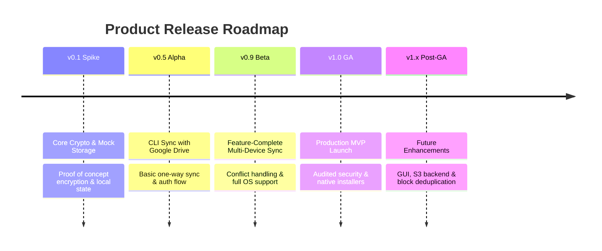

# Secure Cross-Platform Folder Synchronization Application — Project Plan

## Executive Summary

The objective of this project is to plan, architect, engineer, and deliver a secure, cross-platform file synchronization application written in Go (Golang). The application will seamlessly synchronize a local directory with cloud storage (initially Google Drive) across Linux, macOS, and Windows. 

A primary constraint and design pillar is client-side zero-knowledge security: all data and associated metadata must be strongly encrypted locally using a user-supplied password before leaving the host machine. Cloud storage providers must never have access to plaintext filenames, directory structures, timestamps, or content.

This project plan lays out the product definition, architectural strategy, user experience considerations, module-by-module implementation planning, quality assurance/testing strategy, documentation roadmap, and phased release schedule. All items are specified strictly at the project management, architectural evaluation, and task backlog level without prescribing low-level code, API contracts, schemas, or specific cryptographic primitives.

---

## Key Assumptions

1. **Language Choice**: The project will be developed exclusively in Go (Golang) to leverage its strong standard library, cross-compilation primitives, and robust concurrency primitives.
2. **Initial Scope**: Initial release (MVP) targets a command-line interface (CLI) with headless/daemon support; GUI development is deferred to post-1.0 phases.
3. **Primary Cloud Backend**: Google Drive via OAuth 2.0 will serve as the initial launch storage provider, with an abstract backend interface layer planned to accommodate future cloud providers (e.g., S3, WebDAV).
4. **Security Model**: Symmetric password-based encryption takes place entirely client-side. The system assumes that lost passwords cannot be recovered by design (zero-knowledge model).
5. **Target Platforms**: Equal feature parity across 64-bit x86 and ARM architectures for Linux, macOS, and Windows.
6. **Network Reliability**: Operating conditions include unstable, high-latency, or periodically disconnected network connections.

---

## Major Risks & Mitigation Strategies

| Risk Category | Identified Risk | Impact | Mitigation Strategy |
| :--- | :--- | :--- | :--- |
| **Security** | Unrecoverable data loss due to user forgetting encryption password | High | Implement clear UX warnings during initial setup; mandate key derivative backup seed exports during onboarding. |
| **Security** | Metadata leakage via unencrypted cloud APIs or side-channel file sizes | High | Plan an encrypted manifest and chunking strategy; obscure directory hierarchies and normalize remote payload sizes where practical. |
| **Integrations** | Google Drive API rate limiting, quota exhaustion, or OAuth token invalidation | Medium | Design exponential backoff, request batching, token refresh handling, and offline queuing into cloud transport planning. |
| **Portability** | Inconsistent cross-platform filesystem watcher behavior (inotify vs FSEvents vs ReadDirectoryChangesW) | High | Establish a unified filesystem event abstraction layer; pair active event monitoring with periodic fallback scans. |
| **Data Integrity** | State corruption or partial file uploads due to power loss or network interruption | High | Plan atomic transaction commits for local indexes and staged, resume-capable upload/download workflows. |
| **Concurrency** | Synchronization loops or race conditions when multi-device edits occur simultaneously | High | Architect deterministic conflict resolution policies and vector/version clock tracking in the sync engine planning phase. |

---

## High-Level Milestones



* **Milestone 1 (M1)**: Architecture & Technical Specification Sign-off
* **Milestone 2 (M2)**: Core Encryption & Storage Abstraction Modules Validated
* **Milestone 3 (M3)**: Local Sync Engine & Cross-Platform Watcher Functional Prototype
* **Milestone 4 (M4)**: Google Drive Backend & OAuth Transport Functional
* **Milestone 5 (M5)**: Feature-Complete CLI Application Integration
* **Milestone 6 (M6)**: Security Audit, Resilience Verification & Cross-Platform CI Pass
* **Milestone 7 (M7)**: v1.0 General Availability (GA) MVP Release

---

## Hierarchical Project Backlog

```
Epic
 └── Story
      └── Task
```

### Epic 1: Product Definition & Scope Management

#### Story 1.1: Product Requirements & Scope Boundaries
* **Task 1.1.1**: Define functional requirements for initial release (MVP) vs. post-1.0 releases.
* **Task 1.1.2**: Define explicit out-of-scope boundaries (e.g., real-time collaborative editing, multi-user access control).
* **Task 1.1.3**: Establish hardware resource consumption bounds (CPU, memory footprint, disk I/O, network bandwidth).

#### Story 1.2: Threat Modeling & Security Specification
* **Task 1.2.1**: Draft threat model covering remote cloud compromise, local storage inspection, and adversary-in-the-middle attacks.
* **Task 1.2.2**: Formulate zero-knowledge security requirements and key management constraints.
* **Task 1.2.3**: Define metadata protection rules (obfuscation of file paths, directory structures, timestamps, and sizes).

#### Story 1.3: Deletion Policy & Retention Specification
* **Task 1.3.1**: Specify requirements for local deletion behavior options (Immediate Remote Delete, Remote Soft Delete/Archive, Append-Only Storage).
* **Task 1.3.2**: Specify safety guardrails and confirmation thresholds for high-volume deletion operations.
* **Task 1.3.3**: Document risk trade-offs for each deletion policy mode.

---

### Epic 2: System Architecture & Technical Planning

#### Story 2.1: High-Level System Architecture
* **Task 2.1.1**: Map top-level component boundaries (Core Sync Engine, Crypto Layer, Storage Interface, Local State Index, Transport Layer, CLI).
* **Task 2.1.2**: Define data flow models for initial sync, delta sync, download sync, and conflict handling.
* **Task 2.1.3**: Establish criteria for evaluating external third-party Go dependencies.

#### Story 2.2: Encryption Architecture Planning
* **Task 2.2.1**: Plan key derivation evaluation work item (salt generation, memory-hard key stretching parameters).
* **Task 2.2.2**: Define requirements for symmetric payload encryption (chunk-level vs file-level encryption evaluation).
* **Task 2.2.3**: Plan metadata protection architecture (encrypted index vs obfuscated file path layout).
* **Task 2.2.4**: Plan random seed generation and master key wrapper architecture.

#### Story 2.3: Synchronization Engine Architecture
* **Task 2.3.1**: Architect change detection mechanism strategy (hashing vs timestamp comparison vs change journal).
* **Task 2.3.2**: Formulate conflict detection models (vector clocks, content hash comparison, split-brain scenarios).
* **Task 2.3.3**: Define conflict resolution strategy planning (User Prompt, Remote Wins, Local Wins, Rename/Branching).
* **Task 2.3.4**: Plan interrupted sync recovery mechanism (journaling, temporary staging buffers, atomic manifest commits).

#### Story 2.4: Storage Backend Abstraction Layer
* **Task 2.4.1**: Define interface abstraction requirements for cloud storage operations (Upload, Download, List, Delete, GetMetadata).
* **Task 2.4.2**: Design capability negotiation strategy for backends (e.g., chunked uploads, batch requests, transactional operations).
* **Task 2.4.3**: Plan strategy for future cloud backend expansion (Amazon S3, S3-compatible endpoints, WebDAV, SFTP).

#### Story 2.5: Local Index & State Database Architecture
* **Task 2.5.1**: Evaluate local storage engines suitable for embedded Go execution (SQLite, BoltDB/bbolt, key-value stores).
* **Task 2.5.2**: Plan local index schema migration and versioning strategy.
* **Task 2.5.3**: Architect state locking and concurrency safety strategy for multi-process safety.

#### Story 2.6: Cross-Platform Compatibility Architecture
* **Task 2.6.1**: Plan abstraction strategy for path separators, filename normalization (NFC vs NFD UTF-8), and case-sensitivity differences across OSs.
* **Task 2.6.2**: Design cross-platform file attribute mapping strategy (permissions, symlinks, hidden flags).
* **Task 2.6.3**: Formulate platform-specific service packaging architecture (systemd on Linux, launchd on macOS, Windows Service).

---

### Epic 3: User Experience & Interface Planning

#### Story 3.1: Command-Line Interface (CLI) UX Specification
* **Task 3.1.1**: Design CLI command hierarchy (`init`, `sync`, `status`, `config`, `pause`, `resume`, `conflict`).
* **Task 3.1.2**: Define user feedback and progress reporting UI (progress bars, transfer speeds, estimated completion time).
* **Task 3.1.3**: Design non-interactive/headless execution modes for automated background daemon usage.

#### Story 3.2: User Onboarding & Authentication Experience
* **Task 3.2.1**: Design first-time configuration wizard experience.
* **Task 3.2.2**: Formulate OAuth authorization UX flow (browser launch, fallback code copy-paste for headless machines).
* **Task 3.2.3**: Define user instructions and tooling for generating custom Google Cloud OAuth client credentials.

#### Story 3.3: Secret & Password Management UX
* **Task 3.3.1**: Design password entry, confirmation, and validation user workflows.
* **Task 3.3.2**: Evaluate secure credential storage integration (OS keyrings: secret-service/KWallet on Linux, Keychain on macOS, Credential Manager on Windows).
* **Task 3.3.3**: Plan emergency recovery key export UX (mnemonic seed generation or keyfile export).

#### Story 3.4: Configuration & Operational UX
* **Task 3.4.1**: Specify configuration file structure requirements (YAML/TOML/JSON) and environment variable override policies.
* **Task 3.4.2**: Design selective sync and path exclusion pattern specification (e.g., `.syncignore` rules).
* **Task 3.4.3**: Plan user workflow for changing deletion options and conflict resolution preferences.

---

### Epic 4: Module Implementation Planning

#### Story 4.1: Encryption & Security Module Planning
* **Task 4.1.1**: Outline work tasks to build password key derivation component.
* **Task 4.1.2**: Outline work tasks to build streaming payload encryptor and decryptor wrappers.
* **Task 4.1.3**: Outline work tasks to build metadata encryption and path obfuscation module.
* **Task 4.1.4**: Plan cryptographic validation check routines (integrity tags, authentication headers).

#### Story 4.2: Synchronization Core Engine Planning
* **Task 4.2.1**: Schedule tasks for local directory tree traversal and change calculation module.
* **Task 4.2.2**: Schedule tasks for building the state reconciliation planner.
* **Task 4.2.3**: Schedule tasks for sync action execution queue (upload, download, move, delete operations).
* **Task 4.2.4**: Schedule tasks for conflict handling module implementation.

#### Story 4.3: Google Drive Backend Module Planning
* **Task 4.3.1**: Schedule work for Google OAuth 2.0 token management, storage, and auto-refresh module.
* **Task 4.3.2**: Schedule work for Google Drive v3 REST API transport wrapper.
* **Task 4.3.3**: Schedule work for resilient chunked upload/download stream handling with retry mechanisms.
* **Task 4.3.4**: Schedule work for rate limit handling and request throttling.

#### Story 4.4: Cross-Platform Filesystem Monitoring Module Planning
* **Task 4.4.1**: Plan work for integrating OS-native filesystem event listeners (`fsnotify` wrapper).
* **Task 4.4.2**: Plan debouncing and event aggregation pipeline work.
* **Task 4.4.3**: Plan periodic full-scan fallback trigger module.

#### Story 4.5: Configuration & Local State Store Planning
* **Task 4.5.1**: Plan work for configuration loading, validation, and hot-reload routines.
* **Task 4.5.2**: Plan work for local database wrapper and state persistence layer.
* **Task 4.5.3**: Plan work for lockfile and single-instance enforcement module.

#### Story 4.6: Logging, Telemetry & Observability Planning
* **Task 4.6.1**: Plan structured logging implementation tasks (JSON / human-readable toggle).
* **Task 4.6.2**: Design log level controls, log rotation, and sensitive data masking filters (ensure secrets never leak to logs).
* **Task 4.6.3**: Plan sync statistics and metrics collector module.

#### Story 4.7: Failure Recovery & Interruption Management Planning
* **Task 4.7.1**: Schedule work for partial transfer cleanup and temporary file management.
* **Task 4.7.2**: Schedule work for transaction rollback and local state recovery routines.
* **Task 4.7.3**: Schedule work for offline queue persistence and automatic reconnect triggers.

---

### Epic 5: Verification, Quality Assurance & Security Testing Planning

#### Story 5.1: Unit & Component Testing Plan
* **Task 5.1.1**: Define unit test coverage requirements for crypto operations, path normalization, and state reconciliation logic.
* **Task 5.1.2**: Plan benchmark test suite for crypto throughput and state index query performance.
* **Task 5.1.3**: Design mock implementations for backend storage interface testing.

#### Story 5.2: Integration & Emulation Testing Plan
* **Task 5.2.1**: Establish strategy for cloud API integration testing using HTTP stubs and mock Google Drive servers.
* **Task 5.2.2**: Plan end-to-end local filesystem sync integration test suites.
* **Task 5.2.3**: Plan multi-instance sync emulation test harness (simulating 2+ clients updating the same bucket).

#### Story 5.3: Cross-Platform Verification Plan
* **Task 5.3.1**: Set up cross-platform CI matrix testing (Ubuntu Linux, macOS, Windows Server).
* **Task 5.3.2**: Plan verification of path case-sensitivity edge cases and special character encodings across OSs.
* **Task 5.3.3**: Plan permission preservation testing across POSIX and Windows ACL systems.

#### Story 5.4: Security Auditing & Robustness Testing Plan
* **Task 5.4.1**: Plan static security analysis (SAST) and Go dependency vulnerability scanning in CI.
* **Task 5.4.2**: Design cryptographic implementation audit plan (entropy inspection, key leaks in memory, ciphertext randomness).
* **Task 5.4.3**: Plan fuzz testing strategy for manifest parsing and decryption streams.

#### Story 5.5: Reliability & Failure Injection Testing Plan
* **Task 5.5.1**: Plan network chaos testing (simulating packet loss, sudden disconnects, high latency, HTTP 429/503 errors).
* **Task 5.5.2**: Plan process termination testing (killing the app process mid-upload, mid-download, or mid-index write).
* **Task 5.5.3**: Plan storage full / permission denied failure injection testing.

#### Story 5.6: Upgrade & Compatibility Testing Plan
* **Task 5.6.1**: Plan local index database migration testing across version upgrades.
* **Task 5.6.2**: Plan remote manifest schema forward/backward compatibility testing.

---

### Epic 6: Release Engineering, Packaging & CI/CD Planning

#### Story 6.1: Build Systems & Automation Planning
* **Task 6.1.1**: Design multi-stage Go build automation and reproducible build pipeline.
* **Task 6.1.2**: Establish binary signing pipeline (Apple Developer ID for macOS, Code Signing for Windows binaries).
* **Task 6.1.3**: Configure automated release asset creation (tar.gz, zip, checksum generation).

#### Story 6.2: Distribution & Packaging Planning
* **Task 6.2.1**: Plan Linux packaging work (Debian `.deb`, RPM `.rpm`, AUR, AppImage).
* **Task 6.2.2**: Plan macOS packaging work (Homebrew tap formula, signed `.dmg`).
* **Task 6.2.3**: Plan Windows packaging work (Winget manifest, MSI installer).

---

### Epic 7: Technical & User Documentation Planning

#### Story 7.1: Technical Architecture & Developer Documentation
* **Task 7.1.1**: Plan document creation for overall system architecture, component diagrams, and data flows.
* **Task 7.1.2**: Plan creation of Security Model whitepaper detailing zero-knowledge guarantees and metadata protection.
* **Task 7.1.3**: Plan developer onboarding guide (environment setup, building, testing, contributing guidelines).

#### Story 7.2: User Documentation & Onboarding Guides
* **Task 7.2.1**: Plan user installation guide across Linux, macOS, and Windows.
* **Task 7.2.2**: Plan step-by-step tutorial for creating Google Cloud Console projects and obtaining OAuth Client IDs.
* **Task 7.2.3**: Plan user guide for initial sync configuration, password setup, and seed phrase backup.
* **Task 7.2.4**: Plan command reference guide detailing all CLI flags and subcommands.

#### Story 7.3: Operational, Safety & Troubleshooting Guides
* **Task 7.3.1**: Draft guide explaining deletion policies, safety risks, and data recovery options.
* **Task 7.3.2**: Formulate troubleshooting guide for common authentication, network, and conflict errors.
* **Task 7.3.3**: Draft FAQ addressing zero-knowledge security, cloud provider limits, and backup recommendations.

---

## Suggested Implementation Phases



### Phase 1: Architecture & Foundations (Weeks 1-2)
* Finalize threat model and security specifications.
* Complete architectural evaluation of local database engines, serialization formats, and dependency libraries.
* Define component interface boundaries in Go design documents.

### Phase 2: Core Storage & Encryption Layer (Weeks 3-5)
* Implement key derivation, payload encryption/decryption, and metadata obfuscation modules.
* Build local index database storage layer and state migration tools.
* Develop mock cloud backend for offline integration testing.

### Phase 3: Sync Engine & Watcher (Weeks 6-9)
* Develop directory scanner and state reconciliation engine.
* Implement cross-platform filesystem watcher wrapper and debouncer.
* Build conflict detection and resolution handler.

### Phase 4: Google Drive Transport & CLI Integration (Weeks 10-12)
* Implement Google Drive OAuth 2.0 client authentication and token refresh handling.
* Build chunked cloud upload/download transport with exponential backoff.
* Assemble CLI application commands, progress UI, and configuration loader.

### Phase 5: Testing, Hardening & Security Auditing (Weeks 13-15)
* Execute cross-platform CI matrix tests across Linux, macOS, and Windows.
* Conduct failure injection (chaos) testing and network disconnection recovery tests.
* Perform third-party cryptographic review and static security analysis.

### Phase 6: Release Engineering & GA Launch (Week 16)
* Finalize user and developer documentation.
* Configure build signing pipelines and native OS installer packages.
* Release v1.0 GA binary artifacts.

---

## Suggested Release Roadmap



### v0.1 (Architecture Spike)
* Proof of concept for client-side streaming payload encryption and metadata obfuscation.
* Basic local database state persistence.
* Mock storage engine test pass.

### v0.5 (Alpha - Developer Preview)
* Basic one-way and initial synchronization working against Google Drive.
* Interactive CLI setup and OAuth authentication flow.
* Initial cross-platform build validation on Linux, macOS, and Windows.

### v0.9 (Beta - Feature Complete)
* Full bidirectional sync engine operational.
* Conflict detection, resolution modes, and configurable deletion policies.
* Cross-platform filesystem watcher enabled.
* Draft documentation completed.

### v1.0 (General Availability - MVP)
* Audited zero-knowledge encryption implementation.
* Complete CLI application with rich progress feedback and daemon mode.
* RESILIENT handling of network loss, interrupted transfers, and Google Drive rate limits.
* Signed releases, package managers (Brew, Debian, RPM, Winget), and comprehensive user guides.

### v1.x & Beyond (Future Enhancements)
* **Graphical User Interface (GUI)**: System tray icon, visual file activity log, and desktop status notifications.
* **Additional Cloud Backends**: Amazon S3, S3-compatible object stores (MinIO, Backblaze B2), WebDAV, SFTP.
* **Block-Level Deduplication & Delta Sync**: Content-defined chunking (Rabin fingerprints / CDC) for ultra-efficient syncing of large files.
* **Bandwidth Throttling**: User-configurable upload/download speed limits and schedule controls.
